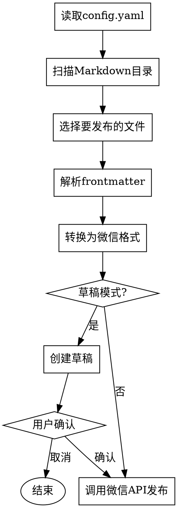

# 自动发布微信公众号

## Overview

实现一个定时任务脚本，扫描本地Markdown目录，自动将最新文章发布到微信公众号订阅号。支持草稿模式先预览再发布。

## When to Use

- 需要将本地Markdown文章定时推送到微信公众号
- 运营每日简报、新闻聚合等订阅号内容
- 希望用简单脚本实现，避免复杂的后台服务

## 核心流程



## 文件结构

```
wechat-publisher/
├── config.yaml          # 配置文件
├── wechat_publisher.py # 主脚本
├── articles/            # Markdown文章目录
│   └── 2024-01-01-hello.md
└── requirements.txt     # Python依赖
```

## 配置 config.yaml

```yaml
wechat:
  appid: "wx1234567890abcdef"
  secret: "your_app_secret"

articles_dir: "./articles"

publish:
  draft_mode: true      # 默认草稿模式
  max_retries: 3

schedule:
  enabled: false        # 定时任务由crontab管理
```

## Markdown文件格式

```markdown
---
title: "文章标题"
author: "作者名"
category: "分类"
cover_image: "https://example.com/image.jpg"
summary: "文章摘要"
draft: true
---

正文内容...

## 二级标题

正文...
```

## 核心实现

### 1. 获取微信Access Token

```python
import requests

def get_access_token(appid, secret):
    url = f"https://api.weixin.qq.com/cgi-bin/token"
    params = {"grant_type": "client_credential", "appid": appid, "secret": secret}
    resp = requests.get(url, params=params).json()
    return resp["access_token"]
```

### 2. 上传图文素材

```python
def upload_article(access_token, title, author, content, thumb_url=None):
    url = f"https://api.weixin.qq.com/cgi-bin/draft/add?access_token={access_token}"
    
    article = {
        "title": title,
        "author": author,
        "content": content,
        "digest": summary,
        "content_source_url": "",
        "thumb_media_id": thumb_media_id,  # 需要先上传封面
    }
    
    resp = requests.post(url, json={"articles": [article]}).json()
    return resp.get("media_id")
```

### 3. 选择最新文件

```python
import os
from pathlib import Path

def get_latest_article(articles_dir):
    md_files = list(Path(articles_dir).glob("*.md"))
    if not md_files:
        return None
    return max(md_files, key=os.path.getmtime)
```

### 4. 解析Markdown

```python
import frontmatter

def parse_markdown(file_path):
    post = frontmatter.load(file_path)
    return {
        "title": post.metadata.get("title", "无标题"),
        "author": post.metadata.get("author", "匿名"),
        "category": post.metadata.get("category", "未分类"),
        "content": post.content,
    }
```

### 5. Markdown转微信HTML

微信公众号支持HTML标签，需转换：

```python
import re

def markdown_to_wechat(md_content):
    html = md_content
    
    # 代码块
    html = re.sub(r'```(\w*)\n(.*?)```', r'<pre>\2</pre>', html, flags=re.DOTALL)
    
    # 加粗
    html = re.sub(r'\*\*(.*?)\*\*', r'<strong>\1</strong>', html)
    
    # 斜体
    html = re.sub(r'\*(.*?)\*', r'<em>\1</em>', html)
    
    # 链接
    html = re.sub(r'\[(.*?)\]\((.*?)\)', r'<a href="\2">\1</a>', html)
    
    # 图片
    html = re.sub(r'!\[(.*?)\]\((.*?)\)', r'', html)
    
    # 标题
    html = re.sub(r'^### (.*?)$', r'<h3>\1</h3>', html, flags=re.MULTILINE)
    html = re.sub(r'^## (.*?)$', r'<h2>\1</h2>', html, flags=re.MULTILINE)
    html = re.sub(r'^# (.*?)$', r'<h1>\1</h1>', html, flags=re.MULTILINE)
    
    # 换行
    html = html.replace("\n\n", "</p><p>")
    html = f"<p>{html}</p>"
    
    return html
```

## 定时任务配置

### crontab (macOS/Linux)

```bash
# 每天早上8点执行
0 8 * * * /usr/bin/python3 /path/to/wechat_publisher.py >> /var/log/wechat_publisher.log 2>&1
```

### macOS launchd

创建 `~/Library/LaunchAgents/com.wechat.publisher.plist`:

```xml
<?xml version="1.0" encoding="UTF-8"?>
<!DOCTYPE plist PUBLIC "-//Apple//DTD PLIST 1.0//EN" "http://www.apple.com/DTDs/PropertyList-1.0.dtd">
<plist version="1.0">
<dict>
    <key>Label</key>
    <string>com.wechat.publisher</string>
    <key>ProgramArguments</key>
    <array>
        <string>/usr/bin/python3</string>
        <string>/path/to/wechat_publisher.py</string>
    </array>
    <key>StartCalendarInterval</key>
    <dict>
        <key>Hour</key>
        <integer>8</integer>
        <key>Minute</key>
        <integer>0</integer>
    </dict>
</dict>
</plist>
```

加载:
```bash
launchctl load ~/Library/LaunchAgents/com.wechat.publisher.plist
```

## 使用方式

```bash
# 安装依赖
pip install -r requirements.txt

# 手动发布最新文章
python wechat_publisher.py

# 手动指定文件
python wechat_publisher.py --file "2024-01-01-hello.md"

# 直接发布（跳过草稿）
python wechat_publisher.py --publish
```

## 依赖 requirements.txt

```
requests>=2.28.0
python-frontmatter>=1.0.0
PyYAML>=6.0
```

## 常见问题

### Q: 草稿在哪里查看？
A: 登录微信公众平台后台 -> 草稿箱

### Q: 如何处理图片？
A: 微信公众号图片需要先上传到微信素材库获取media_id，或使用已上传的图片URL

### Q: access_token过期怎么办？
A: 脚本每次调用前检查token有效性，过期则重新获取

### Q: 如何只发布特定文章？
A: 在frontmatter中添加 `draft: true`，运行不带 `--publish` 参数即可预览

## 微信公众号文章格式规范

### 字段长度限制

- **标题**：最多20个字符（含中文和英文）
- **作者**：最多5个中文字符（或10个英文字符）
- **摘要(digest)**：最多20个字符

### 编码要求

发送JSON请求时必须使用UTF-8编码：

```python
import json

resp = requests.post(
    url, 
    data=json.dumps({"articles": [article_data]}, ensure_ascii=False).encode('utf-8'),
    headers={'Content-Type': 'application/json; charset=utf-8'}
).json()
```

### 封面要求

- 必须提供封面图片的media_id（需先上传到微信素材库）
- 必须提供裁剪参数：
```python
"pic_crop_235_1": "0_0_1_1",
"pic_crop_1_1": "0_0_1_1"
```

### 内容格式

#### 不要使用外部图片链接
微信不支持外部图片，图片会显示不出来。如需图片，需先上传到微信素材库。

#### 使用HTML字体颜色强调重点（不超过3种颜色）
```html
<font color="#E74C3C">红色 - 最重要强调</font>
<font color="#3498DB">蓝色 - 概念/关键点</font>
<font color="#27AE60">绿色 - 补充信息</font>
```

#### 标题格式
建议使用"一、二、三"编号，或"## 1."格式

#### 不要使用表格
微信对表格支持不好，格式会乱。改用列表形式：
```html
<font color="#E74C3C">金融、电商领域</font>：渗透率超过30%
<font color="#3498DB">制造业</font>：接近20%
<font color="#27AE60">医疗领域</font>：用户复购率超过40%
```

#### 使用分隔线分隔段落
```markdown
---
```

#### 示例frontmatter
```yaml
---
title: "文章标题（不超过20字）"
author: "作者名（不超过5个中文字）"
category: "分类"
summary: "摘要（不超过20字）"
draft: true
---
```

### 常见错误码

- 45003：标题超长
- 45110：作者超长
- 45004：摘要超长
- 40007：无效的media_id（封面图片）
- 53402：封面裁剪参数错误
